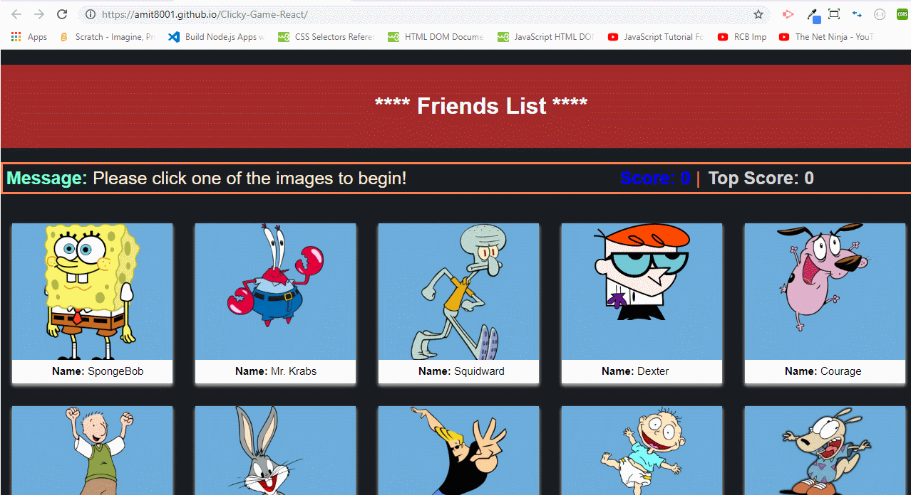

# Clicky-Game-React
1. I developed this application using React.JS. This is only a client side REACT app. There is no backend layer to this.  

2. When the application starts, it displays different images/icons to the screen. Each image listens for click events.

4. When a user clicks on an image for the first time, his/her score is incremented. The user's score is reset to 0 if they click the same image more than once. (Once the user's score is reset after an incorrect guess, the game restarts.)

5. Also, every time an image is clicked, the images rendered to the page get shuffled themselves in a random order.

6. I deployed this to gihub pages and this is published @ https://amit8001.github.io/Clicky-Game-React/

7. Please see below gif to see the app in action!

8. 
